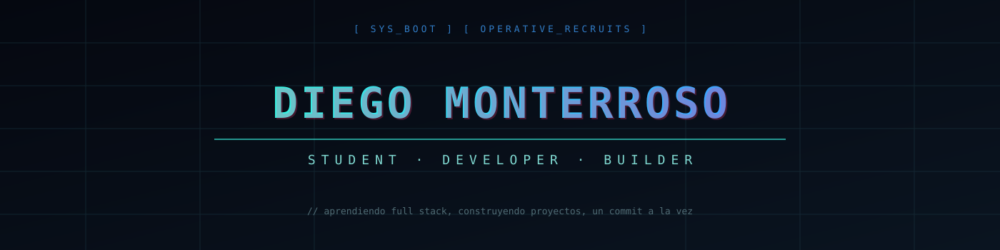

<div align="center">



<br><br>

<a href="https://www.linkedin.com/in/diego-monterroso-1730b3422" target="_blank"></a>
<a href="https://portafoliodesarrollador.web.app" target="_blank"></a>


<br><br>


</div>

<br>

## 〔 WHOAMI 〕

<table>
<tr>
<td width="50%">

```bash
┌──(diego@monterroso)-[~]
└─$ whoami --verbose

UID       : Diego Monterroso
LOCATION  : Guatemala
ROLE      : Student · Full Stack Dev
PRINCIPLE : "Aprender haciendo"
STATUS    : ████████ ONLINE
```

</td>
<td width="50%">

```bash
┌──(diego@monterroso)-[~]
└─$ cat focus.txt

LANGUAGES : JS · Java
TOOLS     : Git · Node · Dotnet
FOCUS     : Full Stack · Buenas prácticas
NOW       : [ Aprendiendo ] [ Construyendo ]
OPEN FOR  : Colab · Proyectos · Open Source
```

</td>
</tr>
</table>

<br>

## 〔 TECH STACK 〕

<div align="center">

**◆ Languages & dev tools ◆**


<br><br>

**◆ Databases ◆**


<br><br>

**◆ Tools & environment ◆**


</div>

<br>

## 〔 GITHUB STATS 〕

<div align="center">


</div>

<br>

## 〔 CONTRIBUTION GRAPH 〕

<div align="center">


</div>

<br>

<div align="center">


</div>
